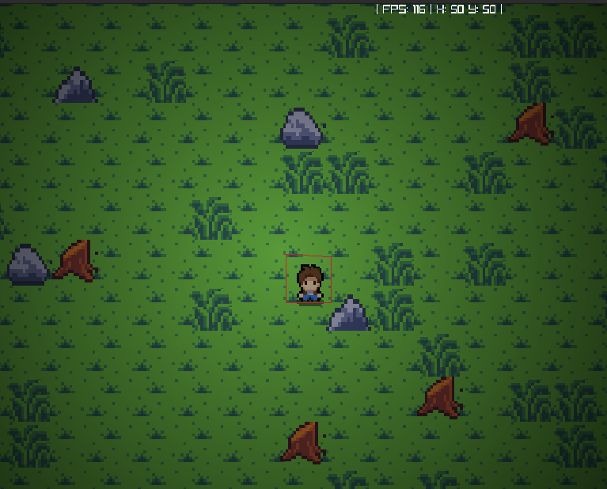

# Dungeon Delve C

- Dungeon Delve C is 2D game crafted in C, by the Raylib library. Engineered with versatility in mind, it is designed to seamlessly run on any operating system, catering to both high-end and low-end hardware configurations. 



- Immerse yourself in a thrilling adventure where players navigate through dynamic environments teeming with challenging obstacles, promising an engaging and immersive gaming experience for all.

## How to Run

To compile and run the game, execute the `run.sh` script provided in the repository. Ensure that you have the necessary dependencies installed, including the Raylib library.

```bash
./run.sh
```

# Structure

```sh
├── LICENSE
├── README.md
└── src/
    ├── main.c                  
    ├── defs.h                  
    ├── structs.h                
    └── entity/
        ├── player.c
        ├── skeleton.c **(TODO)** 
    └── render/
        ├── camera.c
        ├── render.c
    └── res/ *(Images and sounds)*
```

# Contributing

Contributions are welcome! If you find any bugs or have suggestions for improvements, feel free to open an issue or submit a pull request.
